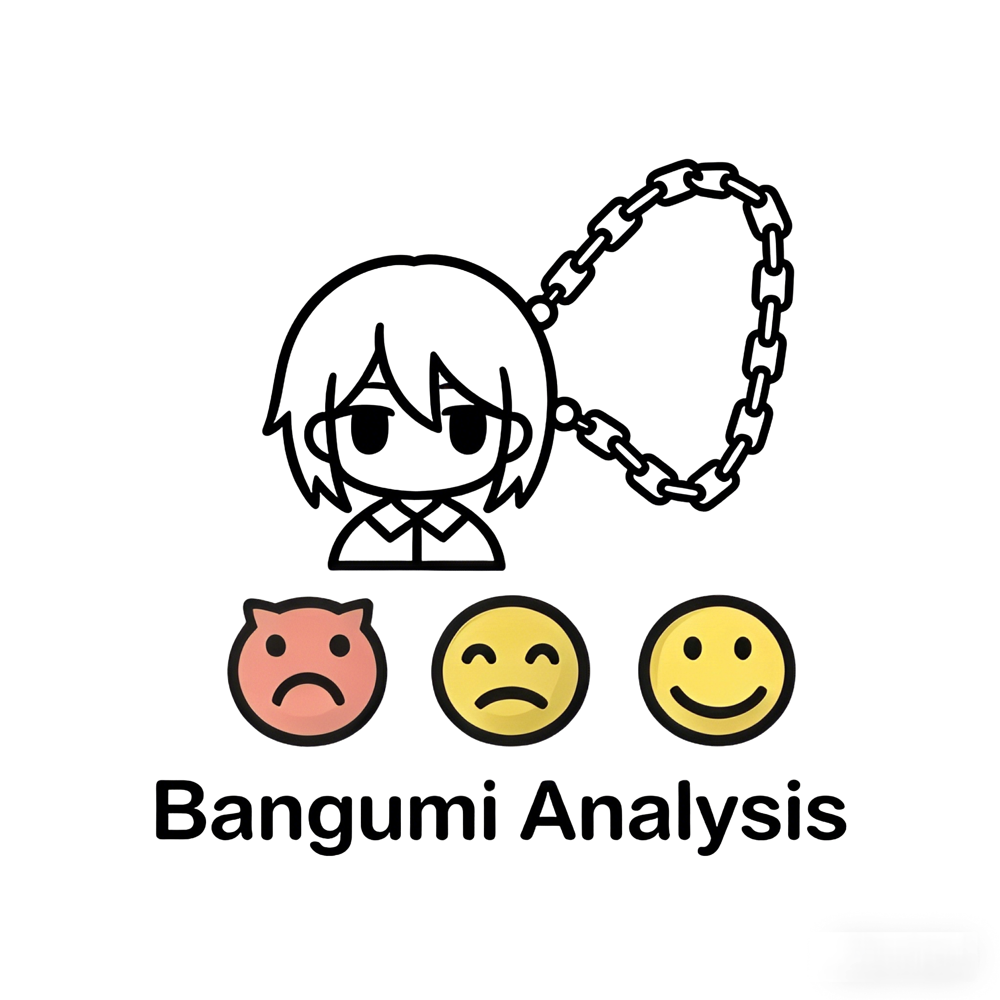
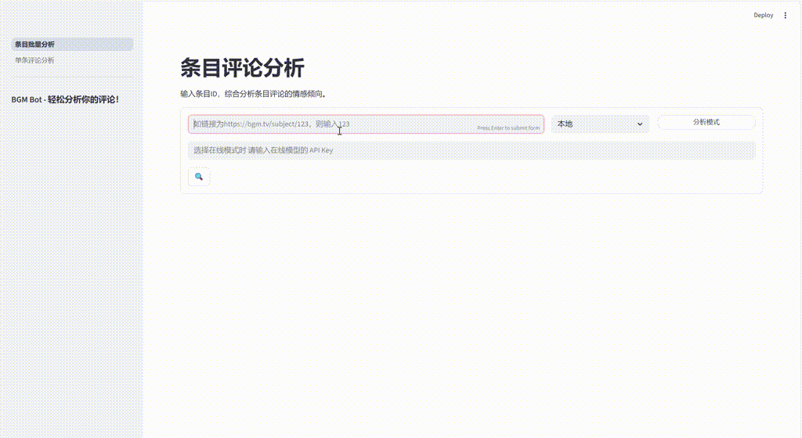
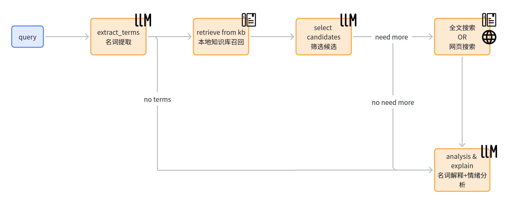
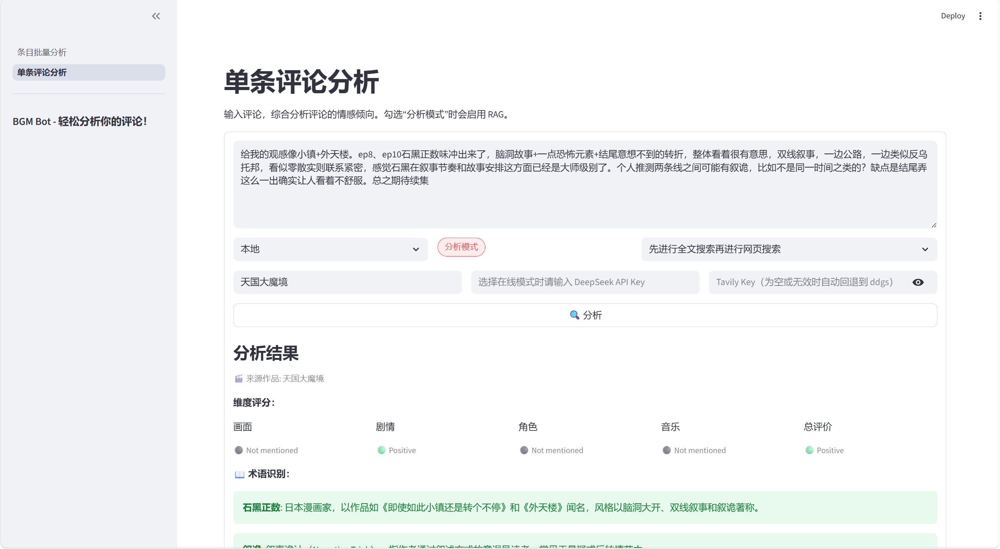
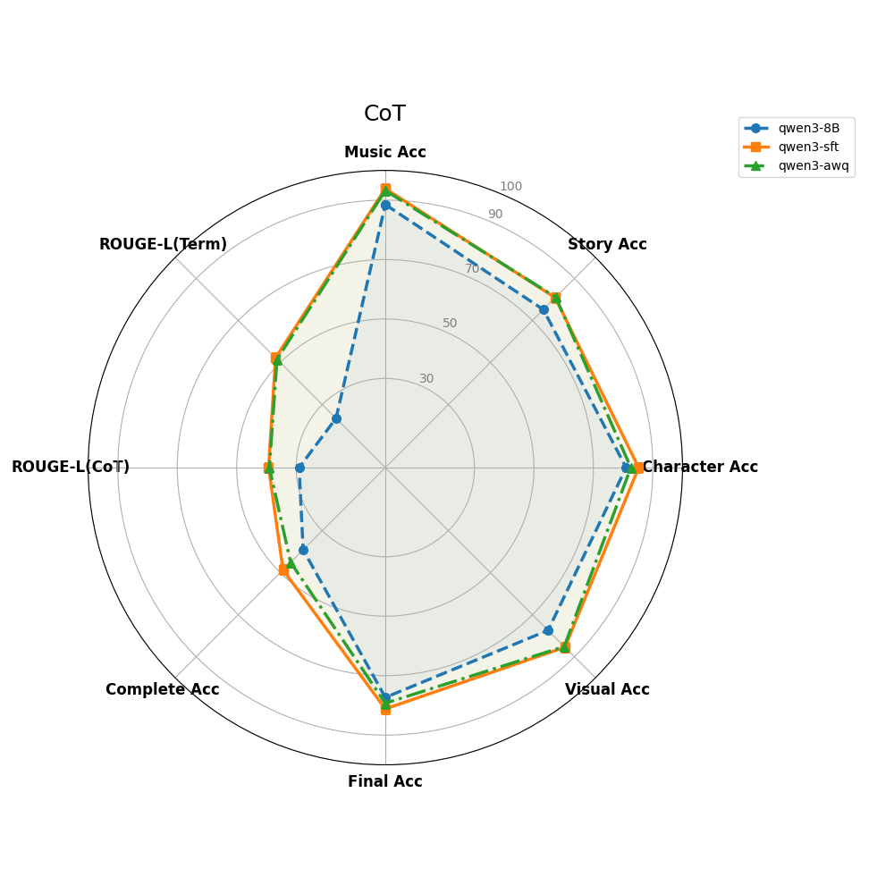
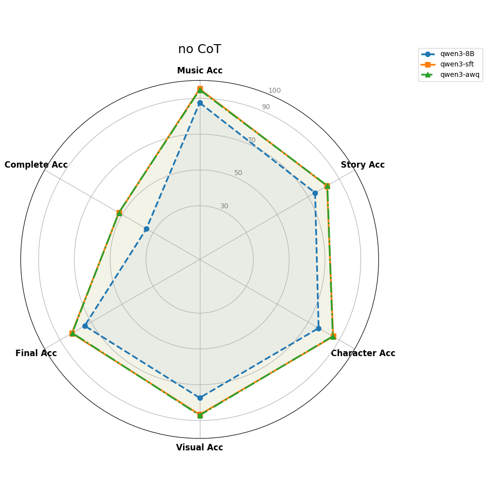

# 🎬 Bangumi-Comment-Bot

  

> **面向 ACG 评论场景的细粒度情感分析系统**
>
> 基于 **Qwen3-8B 指令微调**，结合 **CoT 分析模式** 与 **Agentic RAG 检索增强**，对 Bangumi 等社区评论进行术语解释、深层语义理解和多维情感判断。

<div align="center">
  
  <br>
  
</div>

## 📖 项目简介

二次元评论里经常包含作品简称、角色昵称、黑话、反讽和高上下文依赖表达。仅依靠通用情感分类模型，往往很难稳定理解这类评论的真实含义。

本项目围绕这一问题构建了一个面向 ACG 场景的评论分析系统，包含两条互补路径：

- **基础分析路径**：使用经过指令微调的模型直接输出结构化情感判断，适合快速、轻量的评论分析。
- **Agentic RAG 路径**：在“分析模式”下，先抽取评论中的 ACG 术语，再结合本地知识库、FTS 全文检索与网页补召回，为模型补充解释上下文，从而降低术语幻觉与误判。

系统最终会从 **剧情（Story）/ 作画（Visual）/ 角色（Character）/ 音乐（Music）** 四个维度给出情感倾向，并输出整体结论与置信度。

## ✨ 核心功能

- **细粒度情感分析**：输出结构化 JSON 结果，覆盖剧情、作画、角色、音乐和整体情感。
- **分析模式（CoT + RAG）**：在需要时识别黑话、别名、简称与术语，并生成带解释的深度分析。
- **Agentic RAG 工作流**：本地精确召回失败后，可按策略继续进行 **FTS5** 或 **Web Search** 补召回。
- **双模型调用方式**：
  - **在线模式**：调用 DeepSeek API。
  - **本地模式**：通过 **vLLM** 加载本地模型进行推理。
- **可选来源作品提示**：可手动输入评论所属番剧/作品名，用于检索消歧和分析增强。
- **数据采集工具**：内置 Bangumi 评论爬虫，便于扩充数据集与构建实验语料。

## 🧠 Agentic RAG 是如何工作的

当前仓库中，**Agentic RAG 主要接入在单条评论分析页面的“分析模式”**。如果不启用分析模式，系统会直接走普通模型分析，不触发知识检索。

### 工作流概览



```text
用户评论
  -> 提取 ACG 名词 / 黑话
  -> 本地 SQLite 精确召回
  -> LLM 筛选候选词条
  -> 若本地召回不足，则按 fallback_strategy 执行:
       FTS5 全文补召回 / Web Search 补召回
  -> 压缩上下文
  -> 最终生成术语解释 + 分步分析 + 多维情感结果
```

### 检索阶段说明

| 阶段 | 数据源 | 作用 | 特点 |
|---|---|---|---|
| 本地精确召回 | SQLite `wiki_entries` | 第一优先级 | 使用 `title / aliases / tags` 高精度命中 |
| FTS 补召回 | SQLite FTS5 表 | 本地补漏 | 处理长尾词、变体词、弱匹配 |
| Web 补召回 | Tavily 或 ddgs | 外部兜底 | 处理本地库没有的词条 |

### Fallback 策略

单条评论分析页面支持以下四种 fallback 顺序：

- **先进行全文搜索再进行网页搜索**
- **先进行网页搜索再进行全文搜索**
- **只进行全文搜索**
- **只进行网页搜索**

其中，网页补召回默认逻辑为：

- 如果填写了有效的 **Tavily API Key**，优先使用 **Tavily**
- 如果 Tavily Key 为空或调用失败，自动回退到 **ddgs**

### 当前 RAG 设计特点

- 只在“分析模式”中启用，避免普通模式额外引入延迟。
- 对泛词、噪声词和低价值页面做了过滤，尽量减少错误召回。
- 根据评论长度与提取术语数动态调整检索宽度和上下文预算。
- 最终不会直接把整篇知识条目喂给模型，而是做短上下文压缩，降低“复述剧情”的倾向。

## 🛠️ 安装与准备

### 1. 环境配置

建议使用 Conda 创建虚拟环境：

```bash
conda create -n bgm_bot python=3.12.3
conda activate bgm_bot
pip install -r requirements.txt
```

### 2. 模型准备

本项目基于 **Qwen3-8B** 微调，请先准备基座模型和微调权重：

- **基座模型**：[Qwen/Qwen3-8B](https://huggingface.co/Qwen/Qwen3-8B)
- **微调权重**：已上传至 [ModelScope](https://modelscope.cn/models/ghostintheshell/qwen3-bgm)

下载后可将模型或量化权重放到你本地约定的目录，并在 `utils/inference_vllm.py` 中调整对应路径。

### 3. 数据准备

你可以直接使用 `jsons/` 目录下的示例数据，也可以抓取新数据：

```bash
python scraper/scraper.py
```

抓取结果会保存到 `jsons/` 目录。

### 4. RAG 知识库准备

若你希望启用单条评论分析中的 Agentic RAG，请下载上传在魔搭平台的 SQLite 知识库：
知识库已上传至 [ModelScope](https://modelscope.cn/models/ghostintheshell/qwen3-bgm)

- 主表：`wiki_entries`
- 全文索引表：`wiki_entries_fts`

当前代码（配置在`single_comment_config.py`） 中默认使用固定知识库路径：


```text
/root/dataset/ACG_kb.db
```

知识库中包含以下字段：

| 字段 | 说明 |
|---|---|
| `id` | 主键 |
| `title` | 词条标题 |
| `content` | 词条正文 |
| `category` | 词条类别 |
| `aliases` | 词条别名 |
| `tags` | 标签 |

如果你的知识库路径或表结构不同，可以在代码中做相应调整。

## 🚀 快速开始

启动图形界面：

```bash
streamlit run menu.py
```

在条目批量分析界面输入 demo，可查看演示数据。本地模型路径可在 `utils/inference_vllm.py` 中自定义。

### 1. 单条评论分析 



输入一段评论后，系统会实时给出分析结果。

支持能力如下：

- **本地 / 在线模型切换**
- **普通模式 / 分析模式切换**
- **来源作品名输入（可为空）**
- **Fallback Strategy 选择**
- **Tavily API Key 输入（为空时自动回退 ddgs）**

两种模式的区别如下：

| 模式 | 是否使用 RAG | 适用场景 |
|---|---|---|
| 普通模式 | 否 | 追求速度、只需要基础情感判断 |
| 分析模式 | 是 | 需要解释黑话、简称、角色梗、作品相关术语 |

### 2. 条目批量分析

选择 `jsons/` 下的某个数据文件后，系统将：

1. 使用本地 vLLM 或在线 API 对评论进行批量推理。
2. 自动解析模型输出的 JSON 结构。
3. 综合分析一个条目的全部评论，生成可视化图表（如雷达图）及模型分析示例。
4. 将结果缓存到 `cached_subject/`。

> 注：当前仓库中的 Agentic RAG 主要集成在单条评论分析流程中；批量分析仍以原有推理流程为主。

## 🔬 方法论

### 1. 数据工程

- **清洗**：从七十余个 Bangumi 条目中筛选约 1.2w 条评论，覆盖多种题材和评论长度分布。
- **标注**：使用 DeepSeek 系列模型作为 Teacher Model，对训练语料进行结构化标注。

### 2. 模型微调

- **架构**：Qwen3-8B + LoRA
- **量化**：微调后使用 AWQ 4-bit 量化
- **部署**：本地推理阶段使用 **vLLM** 进行加速

### 3. RAG 增强

相比单纯依赖微调模型，RAG 路径重点解决以下问题：

- 模型对 ACG 冷门术语、简称、别名理解不足
- 评论语义严重依赖作品背景
- 黑话解释容易出现幻觉
- 情绪判断受错误术语理解影响

因此，当前项目采用“**微调模型 + 轻量 Agentic RAG**”的组合方式：

- 微调模型负责风格理解、情绪归纳和结构化输出
- RAG 流程负责术语补充、背景消歧和知识增强

### 4. 指标分析

测试中对模型在多个情感维度上的准确率与完全准确率进行了评估。带 CoT 的模型还额外考察了思维链与术语解释文本的质量。结果如下：

有 CoT：



无 CoT：



实验中可以观察到：

- 微调后的模型整体效果显著优于微调前
- 量化模型相较原模型准确率下降较小
- 无 CoT 模型在部分分类指标上甚至优于有 CoT 模型

一种可能解释是：CoT 文本长度远大于最终分类结果，在训练损失中占据更高权重，模型更容易优先对齐思维链，而弱化最终分类部分的对齐。

## 📂 文件结构

```text
├── scraper/                    # Bangumi 评论爬虫
├── cached_subject/             # 批量分析结果缓存
├── jsons/                      # 原始评论数据
├── utils/
│   ├── inference_vllm.py       # vLLM 推理与模型路径配置
│   └── lm_api_aysnc.py         # API 异步调用模块
├── dataset/
│   ├── train_lora.py           # LoRA 微调脚本
│   ├── train_dataset.jsonl     # 训练集
│   └── test_dataset.jsonl      # 测试集
├── subject.py                  # 条目批量分析控制器
├── single_comment.py           # 单条评论分析主入口（UI / 模型调度）
├── single_comment_config.py    # 单条分析配置：prompt / blocklist / 常量
├── single_comment_rag.py       # Agentic RAG 工作流：召回 / fallback / 上下文构建
├── menu.py                     # Streamlit 主菜单
└── README.md
```

## ✈️ 当前不足与未来方向

- 数据集覆盖的作品广度仍然有限，模型可能对特定条目形成偏置。
- 当前 RAG 仅接入单条评论分析，未来可进一步扩展到批量分析流程。
- 网页补召回仍受搜索摘要质量影响，后续可加入更稳定的页面抽取与证据压缩。
- ACG 术语库仍需持续扩充，尤其是别名、简称、角色关系和社区黑话。
- 后续计划继续尝试更小参数量模型上的蒸馏与部署优化。

## 📜 免责声明

本项目中的爬虫工具仅供学术研究与个人实验使用。请遵守 Bangumi 网站的 `robots.txt` 规则，合理控制抓取频率，勿将相关工具用于商业用途。

## 📜 RAG数据来源声明

RAG知识库中的数据来自于以下项目数据的筛选:
```text
@dataset{ycwtg2025moegirlpedia_cleaned,
  author    = {YCWTG},
  title     = {MoeGirlPedia_zh_cleaned_latest},
  year      = {2025},
  publisher = {Hugging Face Datasets},
  url       = {https://huggingface.co/datasets/YCWTG/MoeGirlPedia_zh_cleaned_latest},
  urldate   = {2025-11-02},
  note      = {Source: MoeGirlPedia_wikitext_raw_archive (https://huggingface.co/datasets/milashkaarshif/MoeGirlPedia_wikitext_raw_archive). Text licensed under CC BY-NC-SA 3.0 with attribution to MoeGirlPedia contributors.}
}
```


---
